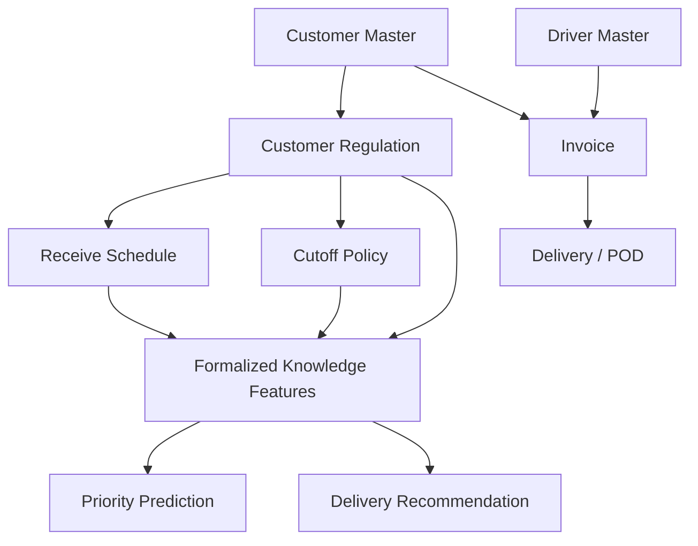
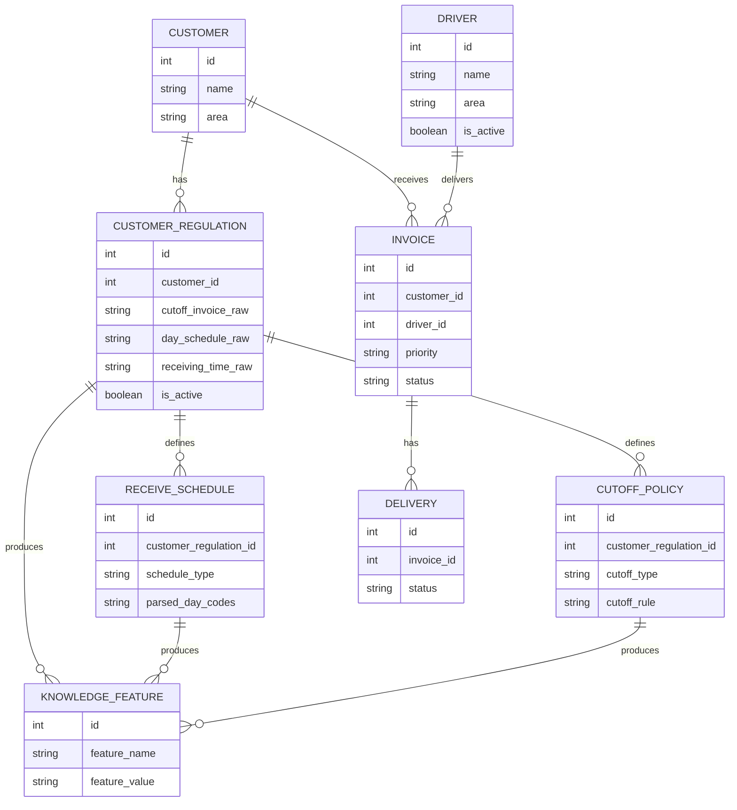

# Data Architecture

Project: Invoice Tracking & Proof of Delivery System  
Research contribution: Operational Knowledge Formalization Framework  
Scope: Data planning for Customer, Driver, Customer Regulation, Receive Schedule, and Cutoff Policy.  
Constraint: This document is planning only. It does not modify schema, database records, UI, business logic, or application code.

## 1. Data Architecture Overview

The data architecture separates operational master data from formalized operational knowledge. Customer and Driver are master data entities. Customer Regulation, Receive Schedule, and Cutoff Policy represent operational rules that explain when, where, and how invoices can be delivered and received.



Data architecture principles:

- Customer and Driver data should remain stable master records.
- Customer Regulation should be treated as policy data, not just descriptive customer text.
- Receive Schedule and Cutoff Policy should be normalized enough to support rules, prediction, recommendation, and reporting.
- Operational decisions should be traceable back to the policy values that influenced them.
- Derived AI features should be reproducible from source data and documented transformations.

## 2. Data Layers

| Layer | Purpose | Examples |
| --- | --- | --- |
| Master Data | Stable operational entities | Customer, Driver |
| Policy Data | Formalized business rules | Customer Regulation, Receive Schedule, Cutoff Policy |
| Transaction Data | Daily operational records | Invoice, Delivery, POD |
| Derived Feature Data | Machine-learning and recommendation inputs | schedule_match, cutoff_type, cutoff_score, area_score |
| Feedback Data | Evaluation and improvement records | PriorityLog, DeliveryRecommendation feedback |
| Analytics Data | Aggregated operational metrics | recommendation score, delivery delay, driver performance |

Recommended ownership:

- Admin owns Customer and Driver master data.
- Operations owns Customer Regulation, Receive Schedule, and Cutoff Policy.
- System owns derived feature values and analytics logs.
- Domain expert validates policy interpretation before model retraining.

## 3. Customer Data

Customer is the primary master entity representing the invoice recipient.

Current customer concept:

| Attribute | Purpose |
| --- | --- |
| id | Internal customer identifier |
| name | Customer display and matching name |
| area | Delivery area or region |
| schedule | Current receiving schedule summary |
| cutoff | Current cutoff summary |
| contact | Contact person |
| phone | Contact phone |
| address | Delivery address |

Recommended customer architecture:

```text
Customer
|-- Identity
|-- Contact information
|-- Delivery location summary
|-- Active regulation reference
|-- Historical invoices
`-- Delivery outcomes
```

Customer data rules:

- Customer name should have a canonical normalized value for matching imported invoice data.
- Customer display name should preserve the business-facing name.
- Area should be standardized enough for driver matching and area analytics.
- Schedule and cutoff summaries may remain on Customer for quick display, but the formal rules should live in policy entities.
- Customer records should not be duplicated just because regulations change.
- Customer regulation changes should be versioned or timestamped.

Customer relationships:

- One Customer can have many Invoices.
- One Customer can have one active Customer Regulation.
- One Customer can have many historical Customer Regulations.
- One Customer can have many Receive Schedule rules through its regulation.
- One Customer can have one or more Cutoff Policy rules through its regulation.

## 4. Driver Data

Driver is the master entity representing a courier or delivery personnel.

Current driver concept:

| Attribute | Purpose |
| --- | --- |
| id | Internal driver identifier |
| name | Driver display name |
| phone | Driver contact number |
| area | Area handled by driver |
| isActive | Driver availability status |

Recommended driver architecture:

```text
Driver
|-- Identity
|-- Contact
|-- Coverage area
|-- Active status
|-- Current workload
|-- Delivery history
`-- Recommendation performance
```

Driver data rules:

- Driver identity should be stable even if assigned area changes.
- Active status controls recommendation eligibility.
- Workload should be derived from active invoices or deliveries, not manually stored as the source of truth.
- Area should be normalized to support matching against customer location.
- Recommendation performance should be evaluated from actual delivery feedback.

Driver relationships:

- One Driver can be assigned to many Invoices.
- Driver workload is derived from invoices with active delivery status.
- Driver performance is derived from Delivery and DeliveryRecommendation feedback.

## 5. Customer Regulation Data

Customer Regulation is the formal source of customer-specific operational rules. It should capture how each customer accepts invoices, documents, goods, and delivery proof.

Source regulation fields observed in the project data include:

| Regulation Field | Meaning |
| --- | --- |
| customer_account | Customer account code or account reference |
| customer_name | Customer name used for matching |
| category | Customer grouping or category |
| sales_pic | Sales or account owner |
| cutoff_invoice | Invoice cutoff rule |
| schedule_payment | Payment schedule rule |
| day_schedule | Receiving day rule |
| location | Delivery location or area |
| courier | Assigned or preferred courier |
| receiving_time | Receiving time window |
| updated_info | Notes or latest regulation update |
| drop_location | Drop-off location detail |
| special_packaging | Packaging requirement |
| healthy_form | Health or administrative form requirement |
| prepare_by_ss | Internal preparation requirement |
| rapid_test | Rapid test requirement, if any |
| goods_delivery | Goods delivery requirement |
| document_delivery | Document delivery requirement |
| goods_desc | Goods delivery description |
| doc_desc | Document delivery description |
| body_temp | Body temperature requirement |
| face_mask | Face mask requirement |
| hand_sanitizer | Hand sanitizer requirement |
| gloves | Gloves requirement |
| faceshield | Face shield requirement |
| email | Regulation contact email |
| phone | Regulation contact phone |

Recommended entity:

```text
CustomerRegulation
|-- id
|-- customer_id
|-- customer_account
|-- category
|-- sales_pic
|-- preferred_courier
|-- location
|-- drop_location
|-- receiving_time_raw
|-- day_schedule_raw
|-- cutoff_invoice_raw
|-- schedule_payment_raw
|-- document_delivery_requirement
|-- goods_delivery_requirement
|-- special_packaging_requirement
|-- health_protocol_requirements
|-- contact_email
|-- contact_phone
|-- notes
|-- effective_from
|-- effective_until
|-- is_active
|-- source_file
`-- source_updated_at
```

Regulation rules:

- Raw regulation text should be preserved for auditability.
- Parsed fields should be derived from raw regulation text.
- Only one active regulation should be used for operational recommendation at a time.
- Historical regulations should remain available to explain older decisions.
- Regulation import should use staging and validation before becoming active master data.

## 6. Receive Schedule Data

Receive Schedule defines when a customer can receive invoices, documents, or goods.

Schedule concepts:

| Concept | Example |
| --- | --- |
| Everyday schedule | Everyday |
| Specific days | Tuesday & Thursday |
| Date-based schedule | Every 15th & 25th in the next month |
| Time window | 09:00 - 15:00 |
| Schedule match feature | Whether today matches allowed receiving day |
| Next receive gap | Days until next allowed receiving day |

Recommended entity:

```text
ReceiveSchedule
|-- id
|-- customer_regulation_id
|-- schedule_type
|-- raw_day_schedule
|-- parsed_day_codes
|-- raw_receiving_time
|-- start_time
|-- end_time
|-- timezone
|-- payment_schedule_text
|-- effective_from
|-- effective_until
`-- is_active
```

Schedule type examples:

| Type | Meaning |
| --- | --- |
| EVERYDAY | Customer can receive every working day or every day |
| WEEKDAY_SET | Customer can receive on specific weekdays |
| MONTH_DATE_SET | Customer can receive on specific dates in a month |
| RELATIVE_MONTH_RULE | Customer can receive based on next-month or end-month rules |
| UNKNOWN | Rule is not yet parsable and needs review |

Derived schedule features:

| Feature | Purpose |
| --- | --- |
| receive_day_code | Normalized day code list |
| weekday_receive | Current or planned receive weekday |
| schedule_match | Whether planned delivery matches customer receiving day |
| time_window_match | Whether current or planned time falls within receiving time |
| next_receive_day_gap | Days until the next valid receiving day |
| missed_receive_schedule | Whether planned delivery missed the schedule |

Schedule rules:

- Raw schedule text should be retained.
- Parsed schedule values should be deterministic and explainable.
- Ambiguous schedules should be flagged for human review.
- Schedule matching should be performed using the planned delivery date, not only the current date.
- Schedule logic should be shared by recommendation and reporting, not duplicated in multiple places.

## 7. Cutoff Policy Data

Cutoff Policy defines the latest acceptable time or date condition for invoice processing, delivery, or payment acceptance.

Cutoff concepts observed in existing feature data:

| Cutoff Type | Meaning |
| --- | --- |
| NO_CUTOFF | No explicit cutoff exists |
| END_MONTH | Cutoff tied to end of month |
| WORKING_DAY | Cutoff tied to working-day count |
| FIXED_20 | Cutoff tied to the 20th date |
| FIXED_25 | Cutoff tied to the 25th date |
| OTHER | Cutoff exists but does not match known categories |
| UNKNOWN | Missing or unclassified cutoff |

Recommended entity:

```text
CutoffPolicy
|-- id
|-- customer_regulation_id
|-- raw_cutoff_text
|-- cutoff_type
|-- cutoff_day
|-- cutoff_time
|-- cutoff_rule
|-- cutoff_value
|-- priority_weight
|-- effective_from
|-- effective_until
`-- is_active
```

Derived cutoff features:

| Feature | Purpose |
| --- | --- |
| cutoff_type | Normalized cutoff category |
| cutoff_rule | Machine-readable rule |
| cutoff_value | Parsed numeric value where applicable |
| cutoff_score | Recommendation or priority urgency score |
| days_to_cutoff | Remaining days before cutoff |
| month_end_flag | Whether the invoice is close to month end |

Cutoff rules:

- Cutoff policy should preserve raw customer wording.
- Parsed cutoff type should be controlled by a documented mapping.
- Cutoff score should be treated as a derived feature, not a customer-entered value.
- Unknown or ambiguous cutoff rules should be routed to review.
- Changes to cutoff mapping should be versioned because they affect prediction and recommendation outputs.

## 8. Data Relationships

Recommended conceptual relationship model:



## 9. Data Flow

Recommended data formalization flow:

```text
Customer regulation source file
-> Staging import
-> Customer name normalization
-> Customer matching
-> Regulation validation
-> Receive schedule parsing
-> Cutoff policy parsing
-> Active regulation selection
-> Invoice enrichment
-> Feature generation
-> Priority prediction
-> Recommendation
-> Delivery/POD feedback
-> Rule and model evaluation
```

Current research feature examples:

| Feature | Meaning |
| --- | --- |
| invoice_age | Days from invoice date to current or processing date |
| current_day | Day used for schedule matching |
| schedule_match | Whether receiving schedule matches planned day |
| time_window_match | Whether time falls inside receiving window |
| area_cluster | Normalized area or location cluster |
| cutoff_type | Normalized cutoff category |
| cutoff_score | Urgency weight derived from cutoff category |
| area_score | Area frequency or area workload weight |

## 10. Data Validation Rules

Customer validation:

- Name is required.
- Area is required.
- Duplicate detection should use normalized customer name.
- Contact fields are optional but should follow consistent formatting.

Driver validation:

- Name is required.
- Phone is required.
- Area is required.
- Inactive drivers should not be recommended for new deliveries.

Customer Regulation validation:

- Must map to one known customer or be flagged as unmatched.
- Raw cutoff, schedule, location, and receiving time should be preserved.
- Active regulation conflicts should be detected.
- Missing critical rules should be flagged for review.

Receive Schedule validation:

- Day schedule must be parsable or marked UNKNOWN.
- Receiving time should parse into start and end time when possible.
- End time must be after start time.
- Date-based schedules should be converted into deterministic rules.

Cutoff Policy validation:

- Raw cutoff text must be preserved.
- Parsed cutoff type must come from a controlled vocabulary.
- Cutoff score must be generated by the system.
- Ambiguous cutoff rules must be reviewed before being trusted by recommendation.

## 11. API Planning

Existing APIs cover Customer and Driver master data. Future policy APIs can be introduced when the policy layer is implemented.

Current API groups:

| API Group | Purpose |
| --- | --- |
| `/api/customers` | Customer master data |
| `/api/drivers` | Driver master data |
| `/api/invoices` | Invoice records using customer and driver references |
| `/api/predict` | Priority prediction using schedule and cutoff inputs |
| `/api/recommendation` | Recommendation using priority, customer, driver, and workload data |

Future policy API groups:

| API Group | Purpose |
| --- | --- |
| `/api/customer-regulations` | Customer-specific operational regulation records |
| `/api/receive-schedules` | Parsed customer receiving schedule rules |
| `/api/cutoff-policies` | Parsed cutoff policy rules |
| `/api/data-quality` | Unmatched customers, ambiguous schedules, invalid cutoff rules |
| `/api/knowledge-features` | Explainable derived feature values for audit and research |

API rules:

- Frontend should not parse regulation files directly.
- Import and parsing should happen through backend-controlled workflows.
- AI module should receive normalized features from backend, not raw spreadsheet rows.
- Policy APIs should expose both raw and parsed values for traceability.

## 12. Operational Knowledge Formalization

Customer Regulation, Receive Schedule, and Cutoff Policy are the data foundation for Operational Knowledge Formalization.

Formalization stages:

1. Capture raw operational knowledge from customer regulation files and staff knowledge.
2. Normalize customer identity, area, schedule, cutoff, and courier references.
3. Parse rules into controlled categories.
4. Derive machine-readable features.
5. Use features in priority prediction and recommendation.
6. Capture delivery outcome and POD feedback.
7. Evaluate whether the formalized rule produced useful decisions.
8. Improve rule mapping and model training data.

Traceability requirement:

```text
Recommendation result
-> Feature values
-> Parsed regulation
-> Raw regulation text
-> Source customer
-> Source file or manual update
```

## 13. Governance and Versioning

Recommended governance:

- Customer master changes should be audited.
- Driver active status changes should be audited.
- Customer Regulation should be versioned by effective period.
- Receive Schedule parsing rules should be versioned.
- Cutoff Policy mapping rules should be versioned.
- Feature generation scripts should have reproducible inputs and outputs.
- Model training datasets should record the source regulation version.

Data quality review queue:

| Issue | Example |
| --- | --- |
| Unmatched customer | Invoice customer name does not match regulation customer name |
| Ambiguous schedule | Schedule text cannot be parsed |
| Ambiguous cutoff | Cutoff text does not match known categories |
| Missing area | Customer location is empty |
| Missing receiving time | Receiving time window unavailable |
| Conflicting active policy | More than one active regulation for same customer |

## 14. Implementation Non-Goals

This document does not:

- Create new database tables.
- Modify existing Customer, Driver, or Invoice models.
- Import customer regulation data.
- Parse Excel files in the application.
- Add API routes.
- Add frontend screens.
- Change prediction or recommendation logic.

## 15. Implementation Readiness Checklist

Before implementation starts, confirm:

- Which customer regulation source file is authoritative.
- Whether customer name matching should use exact, normalized, or fuzzy matching.
- Whether Customer Regulation must support history from day one.
- Whether receiving schedules are based on delivery date, payment date, or invoice date.
- Whether cutoff policy refers to invoice submission, payment, delivery, or document acceptance.
- Which cutoff categories are approved by the domain expert.
- Whether regulation changes require approval before activation.
- Whether derived feature values must be stored or generated on demand.

