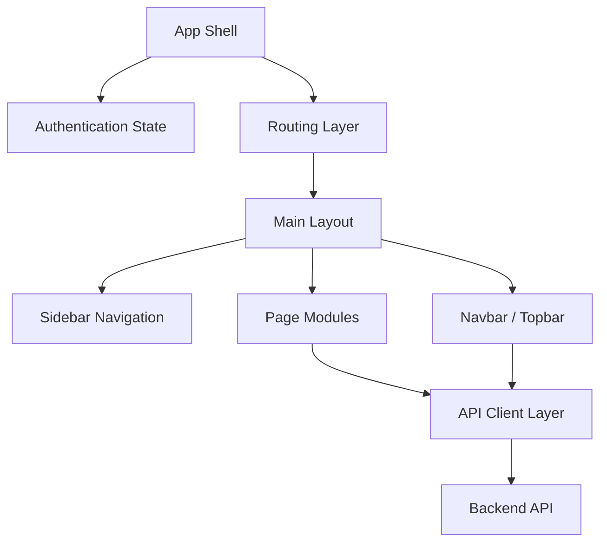

# Frontend Architecture

Project: Invoice Tracking & Proof of Delivery System  
Scope: Architecture planning for Login, Sidebar, Navbar, Dashboard, Notification, Responsive Layout, Theme, and Routing.  
Constraint: This document is planning only. It does not implement UI, business logic, database changes, or feature code.

## 1. Frontend Architecture Overview

The frontend is a React single page application that acts as the operational workspace for admin, staff, and courier users. It should remain focused on presentation, user interaction, API orchestration, and user feedback. Business rules, persistence, prediction, recommendation, and POD storage are owned by the backend and AI services.



Frontend architecture principles:

- The frontend calls only the backend API, never the database or AI module directly.
- Authentication state gates page access through protected routes.
- Shared layout components provide consistent navigation, page titles, actions, and notifications.
- Pages should request data through API service modules, not direct inline endpoint strings.
- UI state should remain separate from operational truth stored in the backend.
- Responsive behavior should be planned at the layout level, not patched page by page.

## 2. Login Architecture

The Login module is the entry point for unauthenticated users.

Responsibilities:

- Accept email and password input.
- Call the authentication API through `authService`.
- Store the returned token and user profile through the agreed client-side session strategy.
- Notify the app shell when authentication succeeds.
- Redirect authenticated users to the dashboard.
- Show loading, validation, and failure states.

Session lifecycle:

```text
Open app
-> Check existing token
-> If token exists, enter protected layout
-> If token is missing, redirect to /login
-> Submit credentials
-> Backend validates credentials
-> Frontend stores session token
-> Redirect to dashboard
-> Logout clears session token
-> Redirect to login
```

Architecture decisions:

- The login page must not contain authorization policy beyond credential submission and session handoff.
- Token validation should eventually use `/api/auth/me`, not only local token existence.
- Password visibility toggle is local UI state.
- Login error messages should come from backend response when available.
- Demo credential helpers, if retained, should be environment-controlled for production safety.

Future extensions:

- Role-aware redirect after login.
- Token refresh or expiry handling.
- Account lockout messaging from backend.
- Forgot password flow.
- Multi-role session context for admin, staff, and courier.

## 3. Sidebar Architecture

The Sidebar is the primary navigation surface for authenticated desktop users and the bottom navigation pattern for smaller screens.

Responsibilities:

- Display product identity.
- Group navigation by workflow.
- Show active route state.
- Surface priority or notification badges when needed.
- Display current user identity.
- Provide logout access.

Navigation groups:

```text
Utama
|-- Dashboard
|-- Input Invoice
|-- Status Tracker
|-- Mode Kurir
|-- Prioritas C4.5
`-- Rekomendasi SAW

Analitik
`-- Analytics Dashboard

Laporan
|-- Laporan
`-- Pelanggan
```

Design contract:

- Desktop: fixed left sidebar with persistent navigation.
- Tablet and mobile: compact bottom navigation with horizontal overflow if needed.
- Active route should use route matching, not manually stored state.
- Navigation labels must remain short and operational.
- Badges should represent meaningful operational counts only.
- Logout must clear session state through the app shell, not only the sidebar component.

Future extensions:

- Role-based menu visibility.
- Collapsible desktop sidebar.
- User profile menu.
- Settings route.
- Count badges from backend notification summaries.

## 4. Navbar / Topbar Architecture

The Navbar, currently represented conceptually as the Topbar, is the page-level command and context area.

Responsibilities:

- Show current page title.
- Show optional page subtitle.
- Provide page-specific actions through an action slot.
- Display current date or operational context.
- Provide notification access.
- Provide refresh or sync action when appropriate.

Recommended structure:

```text
Topbar
|-- Page title
|-- Page subtitle
|-- Context metadata
|-- Notification trigger
|-- Refresh trigger
`-- Page action slot
```

Architecture rules:

- Topbar should be a shared layout component, not duplicated per page.
- Page modules may pass title, subtitle, and actions.
- Topbar should not own page business logic.
- Notification summaries may be loaded by a notification service or dashboard summary service.
- Refresh behavior should prefer re-fetching relevant data through page state instead of full browser reload in future implementation.

Future extensions:

- Breadcrumbs.
- Global search.
- Role-aware action menus.
- Help or documentation link.
- Per-page data freshness indicator.

## 5. Dashboard Architecture

The Dashboard is the operational overview for the system.

Responsibilities:

- Summarize invoice status counts.
- Summarize priority distribution.
- Summarize C4.5 model evaluation status.
- Display recent invoices.
- Highlight high-priority operational risks.
- Provide navigation shortcuts to key workflows.

Dashboard data sources:

| Data | Source API |
| --- | --- |
| Invoice totals by status | `/api/dashboard/stats` |
| Priority distribution | `/api/dashboard/stats` |
| Model accuracy summary | `/api/dashboard/stats` |
| Recent invoices | `/api/invoices` |
| High-priority invoices | `/api/invoices?priority=Tinggi` |
| Customer count | `/api/customers` |
| Driver count | `/api/drivers` |

Dashboard layout:

```text
Topbar
Page container
|-- KPI cards
|-- Delivery activity chart
|-- Priority distribution chart
|-- Recent invoice table
|-- High-priority alert panel
`-- Today summary panel
```

UI states:

- Loading state while dashboard requests are pending.
- Empty state when no invoice data exists.
- Partial data state when optional charts or lists are unavailable.
- Error state when dashboard services fail.
- Responsive state for stacked charts and horizontally scrollable tables.

Architecture rules:

- Dashboard calculations should be minimal presentation calculations only.
- Operational metrics should come from backend aggregation when possible.
- Charts should use stable, normalized data shapes.
- Dashboard must not become the owner of recommendation or prediction logic.

## 6. Notification Architecture

Notification is the frontend surface for operational alerts. It should evolve from derived frontend notifications into a backend-backed notification summary.

Notification categories:

| Category | Example |
| --- | --- |
| Danger | Overdue invoices, returned invoices |
| Warning | High-priority invoices awaiting delivery |
| Info | Invoices currently in delivery |
| Success | All delivery operations are safe |

Notification flow:

```text
Operational data changes
-> Backend derives notification summary
-> Frontend fetches summary
-> Topbar shows unread or active indicator
-> User opens popover
-> Notification list shows actionable items
-> User navigates to relevant workflow
```

Minimum notification payload:

```text
id
type
tone
title
description
relatedEntityType
relatedEntityId
createdAt
isRead
actionRoute
```

Architecture rules:

- Notification generation should eventually move to backend.
- Notification display should be read-only unless a mark-as-read API exists.
- Critical alerts should link to the relevant invoice, tracker, or report view.
- Notification tone must be tied to operational severity.
- The notification component should not query unrelated full datasets long term.

Future extensions:

- Mark as read.
- Notification history.
- Polling or websocket updates.
- User-specific notification preferences.
- Notification rules tied to Operational Knowledge Formalization.

## 7. Responsive Layout Architecture

Responsive layout must be handled as a first-class architecture concern.

Target breakpoints:

| Breakpoint | Layout Behavior |
| --- | --- |
| Desktop, above 1024px | Fixed sidebar, main content offset, wide dashboard grids |
| Tablet, 641px to 1024px | Bottom navigation, stacked content sections, compact topbar |
| Mobile, up to 640px | Single-column content, bottom navigation, scrollable tables, compact charts |

Layout rules:

- Main content must not hide behind the sidebar or bottom navigation.
- Tables should use horizontal scroll rather than squeezed columns.
- KPI cards should reduce from four columns to two columns and then one column.
- Topbar actions should wrap or scroll horizontally.
- Modal and popover surfaces must fit within viewport height.
- Touch targets should remain large enough for courier workflows.
- Signature capture surfaces should preserve usable aspect ratios on mobile.

Responsive ownership:

```text
Global layout CSS
-> Shared component CSS
-> Page-level grid rules
-> Component-specific exceptions
```

Avoid:

- Per-page one-off breakpoints when a shared layout rule can solve the issue.
- Text that overflows buttons, badges, or cards.
- Fixed pixel widths for primary content regions.
- Hidden operational actions on mobile without an alternate path.

## 8. Theme Architecture

The theme should be token-driven so visual decisions remain consistent across pages.

Token categories:

| Category | Examples |
| --- | --- |
| Brand colors | primary, primary-light, primary-dark |
| Priority colors | high, medium, low, normal |
| Status colors | pending, in delivery, delivered, returned |
| Backgrounds | base, surface, elevated, card, input |
| Text | primary, secondary, muted, accent |
| Border | default, hover, accent |
| Shadow | small, medium, large |
| Typography | sans, mono |
| Radius | small, medium, large, full |
| Layout | sidebar width, collapsed width |
| Motion | transition, slow transition |

Theme rules:

- Components should consume CSS variables rather than hard-coded repeated colors.
- Priority and status colors must be semantically distinct.
- Badge contrast must remain readable in all states.
- Chart colors should align with priority/status semantics.
- Typography scale should be consistent between dashboard, forms, tables, and modals.
- Dark mode should be planned as a token swap, not a page rewrite.

Accessibility requirements:

- Text and badge contrast must meet readable contrast expectations.
- Focus states should be visible for keyboard users.
- Icon-only buttons require accessible labels.
- Color should not be the only signal for priority or status.
- Loading, empty, and error states should use plain operational language.

## 9. Routing Architecture

Routing is owned by the app shell and should separate public routes from protected operational routes.

Current route map:

```text
Public
`-- /login

Protected
|-- /
|-- /invoices
|-- /tracker
|-- /courier
|-- /priority
|-- /recommendation
|-- /analytics
|-- /reports
`-- /customers
```

Routing flow:

```text
Browser route requested
-> App shell checks authentication state
-> Public route allowed when unauthenticated
-> Protected route redirects to /login when unauthenticated
-> Authenticated /login redirects to dashboard
-> Protected layout renders sidebar, topbar-capable pages, and page content
```

Route architecture rules:

- Public routes must not render the authenticated app layout.
- Protected routes must share a single layout shell.
- Route definitions should be centralized as the number of pages grows.
- Navigation items should be derived from the route configuration when practical.
- Future nested routes should support detail pages, for example invoice detail and recommendation detail.
- A not-found route should be planned for unknown paths.

Future route expansion:

```text
/invoices/:id
/tracking/:id/history
/recommendation/:id
/reports/delivery
/reports/priority
/settings
/profile
```

Role-based access planning:

| Role | Primary Routes |
| --- | --- |
| Admin | Dashboard, invoices, tracker, priority, recommendation, analytics, reports, customers |
| Staff | Dashboard, invoices, tracker, priority, recommendation |
| Courier | Courier mode, assigned tracking list |

Authorization must be enforced by backend as well as reflected in frontend navigation.

## 10. Cross-Cutting Frontend Concerns

### API Client

- Centralize base URL, token attachment, and response normalization.
- Handle unauthorized responses consistently.
- Keep one service file per backend resource.
- Avoid hard-coded endpoint paths inside page components.

### State Management

- Keep local UI state in components when the state is temporary.
- Keep authenticated session state at app shell level.
- Consider a shared query/data layer if API usage grows.
- Do not duplicate backend-owned operational state across unrelated components.

### Error Handling

- Show user-readable errors.
- Preserve technical error detail for console or diagnostics.
- Do not silently fail critical operations like login, delivery update, or POD save.

### Loading and Empty States

- Every data-driven page should define loading, empty, and error states.
- Skeletons or compact loaders should not shift layout significantly.
- Empty states should guide users to the next operational action.

## 11. Non-Goals

This architecture document does not:

- Implement Login, Sidebar, Navbar, Dashboard, Notification, Theme, Responsive Layout, or Routing changes.
- Modify database schema.
- Add backend routes.
- Add business rules.
- Change visual CSS.
- Change React components.
- Define final production security policy.

## 12. Implementation Readiness Checklist

Before implementation starts, confirm:

- Which roles are required for the first release.
- Whether notification data remains frontend-derived or becomes backend-backed.
- Whether navbar refresh should reload the page or trigger page-level refetch.
- Whether theme supports only light mode or light plus dark mode.
- Whether route configuration should be centralized before adding detail pages.
- Whether mobile courier workflow is the highest-priority responsive path.
- Whether dashboard metrics should be fully backend-aggregated.

