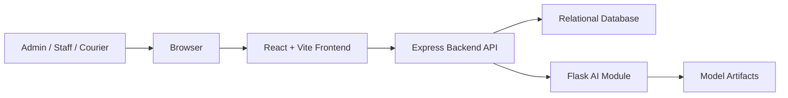
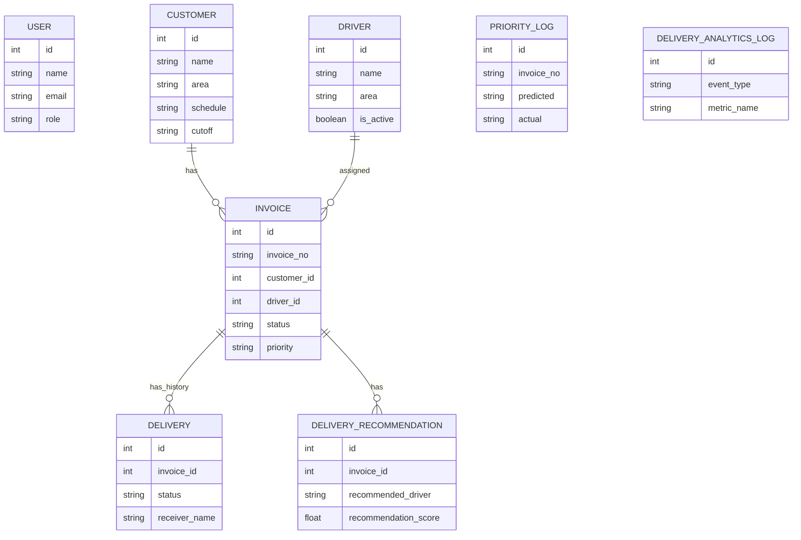
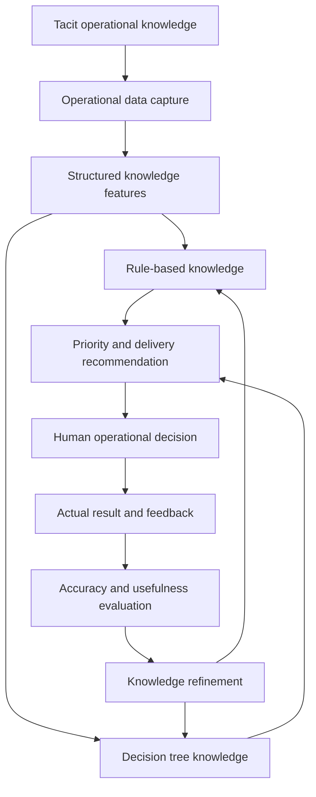
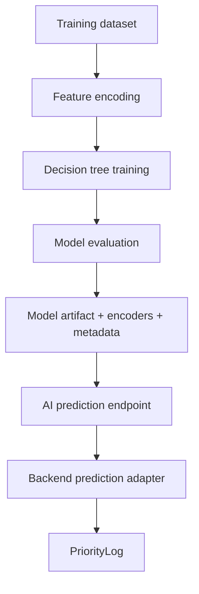

# Website Architecture

Project: Invoice Tracking & Proof of Delivery System  
Research contribution: Operational Knowledge Formalization Framework  
Scope: Architecture planning only. This document does not implement features, business logic, database changes, or UI changes.

## 1. Overall Architecture

The system is designed as a modular web application with three primary runtime layers:

1. Frontend application
   - React single page application used by admin, staff, and courier users.
   - Handles page routing, authenticated screens, form orchestration, dashboard visualization, and API calls.

2. Backend API
   - Express API gateway and application service layer.
   - Owns authentication, invoice data, customer data, driver data, delivery tracking, POD records, prediction logs, recommendation records, and analytics.
   - Acts as the integration boundary between the frontend, database, and AI module.

3. AI module
   - Flask service for C4.5-style decision tree prediction and delivery recommendation support.
   - Maintains trained model artifacts, label encoders, metadata, and recommendation engines.
   - Can be unavailable without breaking the whole system because the backend defines fallback behavior at the service boundary.

High-level runtime view:



Architectural principles:

- Frontend never accesses the database or AI module directly.
- Backend is the single source of operational records.
- AI predictions and recommendations are advisory outputs that must be logged for traceability.
- POD evidence is part of the delivery history, not a separate disconnected feature.
- Operational knowledge must be formalized, versioned, evaluated, and refined from real delivery feedback.

## 2. Technology Stack

| Layer | Technology | Role |
| --- | --- | --- |
| Frontend | React 18 | Single page user interface |
| Frontend tooling | Vite | Local development and production build |
| Routing | React Router | Page hierarchy and protected routes |
| HTTP client | Axios | API communication |
| Charts | Recharts | Dashboard and analytics visualization |
| Icons | Lucide React | Navigation and action icons |
| Backend runtime | Node.js | API runtime |
| Backend framework | Express | REST API routing and middleware |
| Authentication | JWT, bcryptjs | Token authentication and password hashing |
| ORM | Sequelize | Relational data model and associations |
| Database | MySQL or PostgreSQL | Persistent operational database |
| AI API | Flask | Prediction and recommendation service |
| Machine learning | scikit-learn | Decision tree model training and inference |
| AI data processing | pandas, numpy | Dataset loading and feature processing |
| Model persistence | joblib, JSON metadata | Model, encoders, and training metadata |

Deployment architecture should keep these services independently configurable through environment variables:

- Frontend API base URL
- Backend port and database connection
- JWT secret and token lifetime
- AI module URL
- AI module port and model path

## 3. Folder Structure

Current project structure already follows a three-part separation. The architecture should preserve this split and formalize responsibilities:

```text
invoice-tracking/
|-- Website-Architecture.md
|-- PANDUAN_PENGGUNAAN.md
|-- dataset_invoice_simulasi.csv
|-- frontend/
|   |-- src/
|   |   |-- api/
|   |   |-- components/
|   |   |-- data/
|   |   |-- pages/
|   |   |-- App.jsx
|   |   |-- main.jsx
|   |   `-- index.css
|   |-- package.json
|   `-- vite.config.js
|-- backend/
|   |-- config/
|   |-- middleware/
|   |-- models/
|   |-- routes/
|   |-- prisma/
|   |-- server.js
|   `-- package.json
|-- ai-module/
|   |-- app.py
|   |-- train.py
|   |-- model/
|   |-- recommendation_engine.py
|   |-- ranking_engine.py
|   |-- estimation_engine.py
|   |-- explainable_engine.py
|   |-- constraint_model.py
|   `-- requirements.txt
|-- merge-dataset/
`-- Conference_Template/
```

Recommended architecture folders for future growth:

```text
backend/
|-- config/
|-- middleware/
|-- models/
|-- routes/
|-- services/              # Application service boundaries
|-- validators/            # Request validation contracts
|-- policies/              # Authorization and operational policy checks
|-- integrations/          # AI module and external service adapters
|-- jobs/                  # Scheduled or asynchronous work
|-- migrations/            # Explicit schema migrations
`-- tests/

frontend/src/
|-- api/
|-- components/
|-- layouts/
|-- pages/
|-- hooks/
|-- utils/
|-- constants/
|-- routes/
`-- styles/

ai-module/
|-- app.py
|-- train.py
|-- engines/
|-- model/
|-- datasets/
|-- evaluation/
`-- tests/
```

## 4. Module Decomposition

### Frontend Modules

| Module | Responsibility |
| --- | --- |
| Authentication UI | Login, token storage, protected route access |
| Dashboard UI | Operational summary, invoice counts, model accuracy summary |
| Invoice UI | Invoice input, bulk import preparation, priority request trigger |
| Tracker UI | Delivery status monitoring and delivery history visibility |
| Courier UI | Courier workflow for status update and POD capture |
| Priority UI | Standalone C4.5 priority prediction and prediction log review |
| Recommendation UI | SAW recommendation display, ranking, confidence, feedback |
| Analytics UI | Recommendation metrics, driver performance, area statistics |
| Customer UI | Customer master data views and maintenance |
| Report UI | Operational reporting and distribution summaries |
| API client layer | Axios instance and resource-specific API modules |

### Backend Modules

| Module | Responsibility |
| --- | --- |
| Auth module | User registration, login, token verification |
| Invoice module | Invoice lifecycle, filtering, creation, update, import boundary |
| Customer module | Customer master data and delivery constraints |
| Driver module | Driver master data and active driver lookup |
| Tracking module | Delivery status transitions, history records, POD evidence |
| Priority module | C4.5 prediction orchestration and priority log storage |
| Recommendation module | AI recommendation orchestration, result persistence, feedback |
| Analytics module | Aggregated recommendation and delivery performance metrics |
| Dashboard module | Summary counts for operational overview |
| AI integration adapter | Backend-to-Flask contract, timeout, fallback, response normalization |
| Persistence layer | Sequelize models, associations, database connection |

### AI Modules

| Module | Responsibility |
| --- | --- |
| Prediction API | C4.5-style priority prediction endpoint |
| Training pipeline | Dataset loading, feature encoding, model training, evaluation |
| Model store | Decision tree artifact, label encoders, metadata |
| Recommendation engine | Multi-criteria recommendation scoring |
| Ranking engine | Driver ranking and operational constraint evaluation |
| Estimation engine | Delivery time estimation support |
| Explainable engine | Human-readable recommendation explanation |
| Constraint model | Configurable operational constraints |

## 5. Page Hierarchy

Application root:

```text
/login
/
|-- /invoices
|-- /tracker
|-- /courier
|-- /priority
|-- /recommendation
|-- /analytics
|-- /reports
`-- /customers
```

Page responsibilities:

| Page | Route | Main User Goal |
| --- | --- | --- |
| Login | `/login` | Authenticate into the system |
| Dashboard | `/` | Review invoice status, priority distribution, and model summary |
| Input Invoice | `/invoices` | Create, view, filter, and import invoices |
| Status Tracker | `/tracker` | Monitor delivery status and delivery timeline |
| Mode Kurir | `/courier` | Update delivery status and collect POD evidence |
| Prioritas C4.5 | `/priority` | Run or review priority classification |
| Rekomendasi SAW | `/recommendation` | Generate and review delivery recommendations |
| Analytics Dashboard | `/analytics` | Review recommendation, driver, and area metrics |
| Laporan | `/reports` | View operational report summaries |
| Pelanggan | `/customers` | Manage customer operational knowledge |

## 6. Navigation Structure

The navigation should be grouped by user workflow:

```text
Utama
|-- Dashboard
|-- Input Invoice
|-- Status Tracker
|-- Mode Kurir
|-- Prioritas C4.5
`-- Rekomendasi SAW

Analitik
`-- Analytics Dashboard

Laporan
|-- Laporan
`-- Pelanggan

Footer
|-- Pengaturan
`-- User profile / Logout
```

Navigation rules:

- Unauthenticated users can only access `/login`.
- Authenticated users can access operational pages.
- Role-specific visibility should be handled through authorization policy, not only hidden navigation.
- Courier workflows should prioritize delivery update and POD capture.
- Admin workflows should prioritize monitoring, recommendations, analytics, and master data.

## 7. Database Entities

The database should represent both operational transactions and formalized knowledge artifacts.

### Core Entities

| Entity | Purpose | Important Attributes |
| --- | --- | --- |
| User | Authenticated application account | name, email, password hash, role |
| Customer | Customer master data and operational constraints | name, area, schedule, cutoff, contact, phone, address |
| Driver | Courier or delivery personnel master data | name, phone, area, active status |
| Invoice | Main invoice and delivery planning record | invoice number, customer, driver, amount, date, due date, status, priority, schedule, cutoff |
| Delivery | Delivery status history and POD evidence | invoice, status, timestamps, notes, courier signature, receiver name, receiver signature, updated by |
| PriorityLog | Priority prediction traceability | invoice number, input features, predicted priority, actual label, accuracy, confidence |
| DeliveryRecommendation | Recommendation output and feedback record | invoice, priority label, score, recommended day, recommended driver, explanation, feedback, driver ranking, constraints |
| DeliveryAnalyticsLog | Event and metric log for analytics | event type, event payload, metric name, metric value |

### Relationships



Data governance notes:

- Invoice status is the current operational state.
- Delivery is the append-style status and POD history.
- PriorityLog records prediction accountability.
- DeliveryRecommendation records decision support output and actual feedback.
- Analytics logs should be derived from meaningful events, not from frontend-only state.

## 8. API Structure

The backend API is the official contract for frontend and AI integration.

### Application API

| API Group | Base Path | Responsibility |
| --- | --- | --- |
| Health | `/api/health` | Backend availability check |
| Auth | `/api/auth` | Register, login, current user |
| Dashboard | `/api/dashboard` | Operational summary metrics |
| Invoices | `/api/invoices` | Invoice CRUD, filtering, bulk import boundary |
| Tracking | `/api/tracking` | Delivery tracking list, status update, delivery history |
| Customers | `/api/customers` | Customer master data |
| Drivers | `/api/drivers` | Driver master data |
| Predict | `/api/predict` | Priority prediction orchestration |
| Priority Logs | `/api/priority-logs` | Prediction history and actual label feedback |
| Recommendation | `/api/recommendation` | Generate, read, delete, and feedback on recommendations |
| Analytics | `/api/analytics` | Recommendation, driver, and area metrics |

### Representative Endpoint Contracts

| Endpoint | Method | Purpose |
| --- | --- | --- |
| `/api/auth/login` | POST | Authenticate user and return token |
| `/api/auth/me` | GET | Validate token and return user profile |
| `/api/dashboard/stats` | GET | Return invoice, priority, and model summary |
| `/api/invoices` | GET | List invoices with filters |
| `/api/invoices` | POST | Create invoice |
| `/api/invoices/bulk` | POST | Import prepared invoice rows |
| `/api/invoices/:id` | GET, PUT, DELETE | Read, update, or delete invoice |
| `/api/tracking` | GET | List trackable invoices |
| `/api/tracking/:id` | PATCH | Update delivery status and POD fields |
| `/api/tracking/:id/history` | GET | Read delivery history |
| `/api/predict` | POST | Predict invoice priority |
| `/api/priority-logs` | GET | List prediction logs |
| `/api/priority-logs/:id/actual` | PATCH | Store actual label for evaluation |
| `/api/recommendation` | POST | Generate delivery recommendation |
| `/api/recommendation/history` | GET | List recommendation history |
| `/api/recommendation/:id` | GET, DELETE | Read or delete recommendation |
| `/api/recommendation/:id/feedback` | PATCH | Store actual recommendation feedback |
| `/api/analytics/recommendation` | GET | Recommendation performance metrics |
| `/api/analytics/drivers` | GET | Driver performance metrics |
| `/api/analytics/areas` | GET | Area-level delivery metrics |

### AI Module API

| Endpoint | Method | Purpose |
| --- | --- | --- |
| `/health` | GET | AI module availability |
| `/model-info` | GET | Active model metadata |
| `/predict` | POST | Priority prediction |
| `/recommend` | POST | Delivery recommendation |
| `/recommend/health` | GET | Recommendation engine availability |
| `/retrain` | POST | Controlled model retraining endpoint |

API design rules:

- Frontend calls backend only.
- Backend normalizes AI responses before returning them to frontend.
- Backend records predictions and recommendations for auditability.
- Backend should define timeouts and fallback behavior for AI service calls.
- All operational write endpoints should be authenticated.

## 9. Operational Knowledge Flow

Operational Knowledge Formalization Framework converts day-to-day delivery expertise into traceable digital decision support.



Knowledge sources:

- Customer receiving schedule
- Customer cutoff time
- Delivery area
- Assigned driver and driver area
- Active driver workload
- Invoice due date and delivery status
- Courier and receiver POD timestamps
- Actual recommendation acceptance and delivery success

Formalized outputs:

- Priority label
- Prediction confidence
- Recommendation score
- Recommended delivery day
- Recommended driver ranking
- Explanation factors
- Constraint notes
- Feedback metrics

## 10. Priority Recommendation Flow

Priority recommendation combines classification, operational rules, and delivery recommendation.

```text
Invoice and customer data
-> Feature normalization
-> C4.5 priority prediction
-> Priority log persistence
-> Recommendation request
-> Driver workload and constraint evaluation
-> Recommendation result persistence
-> User decision
-> Delivery execution
-> POD and actual feedback
-> Analytics and knowledge refinement
```

Detailed flow:

1. User creates or selects an invoice.
2. Backend gathers customer schedule, cutoff, area, invoice data, and driver context.
3. Backend sends prediction request to AI module.
4. AI module returns priority label, confidence, reason, and model metadata.
5. Backend stores the prediction in PriorityLog when an invoice reference exists.
6. Backend requests delivery recommendation using priority label and driver availability.
7. AI module evaluates recommendation factors and ranks drivers.
8. Backend stores the recommendation and analytics event.
9. User reviews the recommendation and makes the operational decision.
10. Delivery execution and POD capture produce feedback for future evaluation.

Decision-support boundaries:

- The system recommends; humans remain accountable for final operational decisions.
- Every recommendation should be explainable enough for staff to understand why it was produced.
- Actual delivery outcomes should be captured to measure whether the recommendation helped.

## 11. Rule-Based Integration

Rule-based integration supports two architecture needs:

1. Baseline formalization of expert knowledge
   - Converts operational practices into explicit rules.
   - Defines interpretable constraints for schedule, cutoff, area, workload, and delivery feasibility.

2. Resilience and guardrails
   - Provides fallback prediction when AI module is unavailable.
   - Provides operational constraints around recommendation output.
   - Supports explainable notes that users can understand without reading model internals.

Rule architecture:

```text
Operational rule source
-> Rule catalog
-> Rule version
-> Rule evaluator
-> Rule result
-> Explanation
-> Feedback review
```

Recommended rule domains:

- Customer receiving availability
- Cutoff urgency category
- Driver area compatibility
- Driver workload limit
- Business hour feasibility
- Return or failed delivery handling
- POD completeness requirements

Rule governance:

- Rules should be stored or documented as versioned knowledge artifacts.
- Rule changes should be reviewed by domain experts.
- Rule outputs should be logged when they affect recommendation outcomes.
- Rule conflicts should be visible in explanation or operational notes.
- Rules should complement the decision tree, not silently override it without traceability.

## 12. Decision Tree Integration

The decision tree module formalizes historical operational patterns into a predictive priority classifier.

Current model concept:

- Algorithm family: C4.5-style decision tree using entropy / information gain.
- Training inputs: customer, driver, delivery area, receiving schedule, cutoff time.
- Target classes: operational priority pattern, mapped into application priority levels.
- Runtime output: priority label, confidence, reason, raw prediction, model version.

Architecture flow:



Integration requirements:

- Backend must treat the model as an external service contract.
- Model metadata should be visible for traceability.
- Encoders and feature schema must match training and inference inputs.
- Prediction results must be logged with input context and confidence.
- Actual labels must be captured to evaluate accuracy over time.
- Retraining should be controlled and auditable.
- Model fallback must be explicit in API response source metadata.

Recommended model lifecycle:

1. Prepare dataset from operational records and expert labels.
2. Train model with fixed feature schema.
3. Evaluate accuracy, class distribution, and feature importance.
4. Save model artifact, encoders, and metadata.
5. Deploy model to AI module.
6. Monitor prediction logs and actual labels.
7. Retrain only when enough new validated feedback exists.

## 13. POD Integration

POD, or Proof of Delivery, is integrated into the delivery tracking lifecycle.

POD data components:

- Invoice reference
- Delivery status
- Courier signature
- Courier signed timestamp
- Receiver name
- Receiver signature
- Receiver signed timestamp
- Delivery notes
- User or courier who updated the delivery
- Delivered timestamp when applicable

POD flow:

```text
Invoice assigned
-> Courier accepts delivery responsibility
-> Courier signature captured
-> Status moves to in delivery
-> Receiver accepts invoice
-> Receiver name and signature captured
-> Status moves to delivered
-> Delivery history stores evidence
-> Reports and analytics consume delivery result
```

POD architecture rules:

- POD belongs to Delivery history, not only Invoice summary.
- Each status update should create a delivery history record.
- Current invoice status should reflect the latest operational state.
- Signature payloads should be treated as sensitive evidence.
- Long-term scalability should move large signature or image payloads to object storage while keeping metadata in the database.
- POD should be immutable or append-only after submission, except through audited correction workflow.
- Delivery reports should reference POD evidence through delivery history.

Recommended POD validation boundaries:

- Courier signature is expected when delivery responsibility starts.
- Receiver name and receiver signature are expected when delivery is completed.
- Return status should require notes explaining failed delivery.
- Timestamp capture should be generated by backend or trusted service time.

## 14. Future Scalability

### Application Scalability

- Move from route-heavy controllers to service-layer modules as business complexity grows.
- Introduce request validators for consistent API contracts.
- Add role-based access control for admin, staff, and courier workflows.
- Add audit trails for operational changes, recommendation feedback, and POD correction.
- Replace automatic schema synchronization with explicit migrations.
- Add automated tests for API contracts, model integration, and POD workflows.

### Data Scalability

- Add indexes for invoice status, priority, customer area, delivery status, created date, and recommendation timestamps.
- Partition or archive old Delivery, PriorityLog, DeliveryRecommendation, and AnalyticsLog records if volume grows.
- Store binary or large evidence files in object storage instead of relational text columns.
- Add data retention policies for signatures and operational logs.
- Add data quality checks for imported invoice files and training datasets.

### AI Scalability

- Introduce a model registry with model version, dataset version, metrics, and approval status.
- Separate training from inference in production.
- Run retraining as a controlled offline job.
- Add drift monitoring using actual label feedback and delivery outcomes.
- Compare rule-based, decision tree, and future models with reproducible metrics.
- Keep explainability as a required output for operational adoption.

### Integration Scalability

- Use asynchronous jobs or queues for long-running imports, recommendation generation, and retraining.
- Add health checks and circuit breaker behavior around the AI module.
- Add event-driven analytics for recommendation generated, feedback submitted, delivery updated, and POD completed.
- Prepare external integrations for ERP invoice source, email or WhatsApp notifications, GPS tracking, and document storage.

### Deployment Scalability

- Containerize frontend, backend, AI module, and database dependencies.
- Split environment configuration by development, staging, and production.
- Add centralized logging for backend and AI module.
- Add monitoring for API latency, AI module availability, prediction volume, recommendation acceptance, and delivery success rate.
- Use HTTPS, secure JWT configuration, database backups, and least-privilege database credentials.

### Research Scalability

- Preserve the trace from expert knowledge to rule, model, recommendation, user decision, and delivery outcome.
- Maintain datasets used for model training as research artifacts.
- Record model metadata, feature importance, and evaluation metrics per version.
- Compare operational performance before and after recommendation adoption.
- Use feedback loops to show how tacit operational knowledge becomes formalized computational knowledge.

